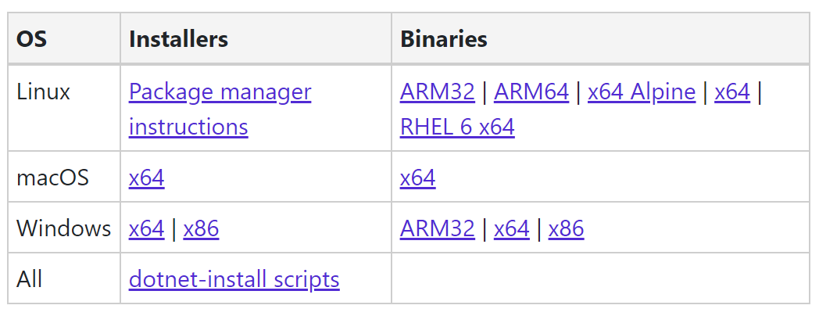
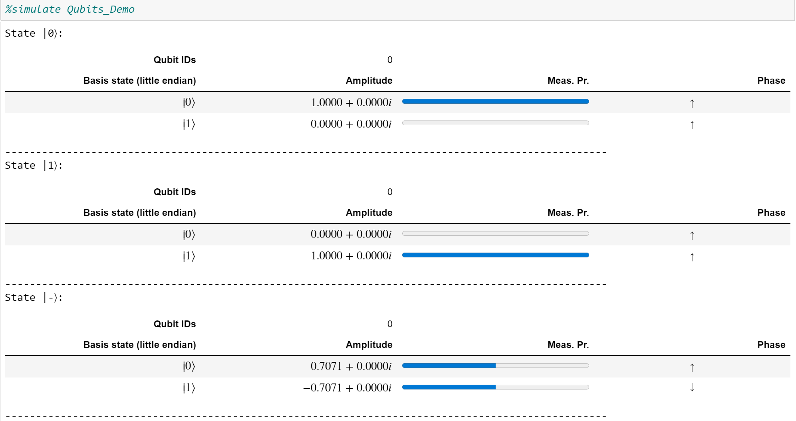

# Quantum Katas/Jupyter Notebook Local Install Instructions

Download the .NET Core SDK from [here](https://dotnet.microsoft.com/download/dotnet-core/3.1). Pick the right version from the table below (found under the SDK header) based on your OS/preference and install.



>If you are using Linux, follow the 'Package manager instructions' link and select the right distribution from the dropdown menu at the top left of the page. Then follow the instructions under the subheadings `Register Microsoft key and feed` and `Install the .NET Core SDK`.

Make sure you have Python 3.6 or above installed. You can check your installed version by typing: `python3 --version` into your terminal.

Make sure you have Jupyter installed. If you don’t, instructions can be found [here](https://jupyter.readthedocs.io/en/latest/install.html).

>I would recommend using the Anaconda method (or [miniconda](https://docs.conda.io/en/latest/miniconda.html) for a more lightweight version) as suggested in the Jupyter instructions. Don't forget to add to your local PATH during install! If you do, create a new environment using `conda create --name myenv` and then activate it using `conda activate myenv` (replace `myenv` with your choice of environment name).

Run the following commands:
```
pip install qsharp
dotnet tool install -g Microsoft.Quantum.IQSharp
dotnet iqsharp install
```

If you aren't using Anaconda, run the following two commands:
```
pip install pytest
pip install matplotlib
```

If you are using Anaconda, run these instead:
```
conda install pytest
conda install matplotlib
```

If you have git installed, download the katas using the following command:
```
git clone https://github.com/Microsoft/QuantumKatas.git
```

Otherwise, download it from [here](https://github.com/Microsoft/QuantumKatas/archive/master.zip) and unzip.

`cd` into the new directory containing the katas.

Type:
```
jupyter notebook
```
into the terminal and go to the link it provides you with (if it doesn’t automatically open a browser window for you). Open up `index.ipynb` in the home folder.

Navigate to `The Qubit` from the `List of Tutorials` menu. To test everything has installed correctly, run the first two code blocks using `Shift-Enter`. You should see something like this:



>Stop there! I'll be giving an introduction to  Q# and the QDK on Thursday  and you'll get the chance to work through these exercises in the workshop later that afternoon. No spoilers!
